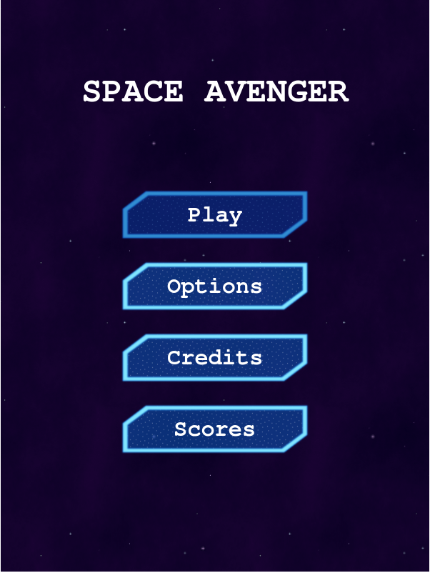
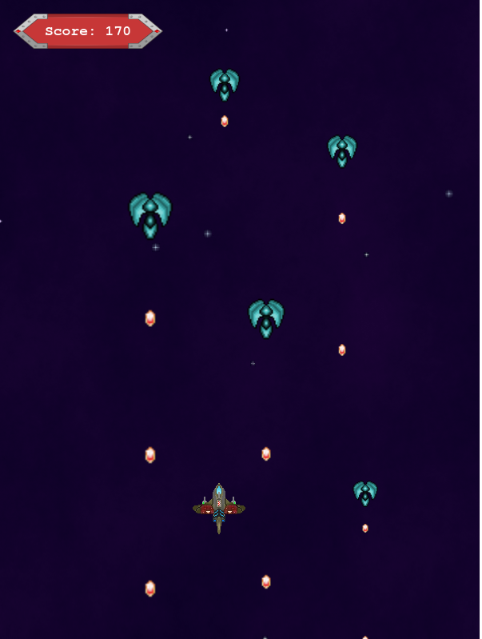

# Space Avenger

>  A space shooter game build with Phaser 3, javascript and webpack, this project is a capstone project for the javascript curriculum of microverse

### Main Menu:


### Game scenario:



## [Check my Game Design Document](./docs/GDD.md)

## Built With

- HTML 
- JAVASCRIPT
- PHASER 3
- NPM
- WEBPACK
- Babel
- JEST

## [Live Link](https://helman101.github.io/Space-Shooter/)

## Instructions to Play


  Play with the Arrows:

  - ARROW UP move you UP
  - ARROW DOWN move you DOWN
  - ARROW LEFT move you LEFT
  - ARROW RIGHT move you RIGHT

  - And press SPACE to SHOOT


## Do you want to clone?

### Getting Started

- Go to your terminal
- Put `git clone git@github.com:helman101/Space-Shooter.git`
- Go to the project folder with `cd Space-Shooter`

### Setup

- Inside the project folder
- Run `npm install`
- Run `npm start`
- On your browser, make sure you point to the right address (i.e: http://localhost:8080/)

### Run tests

- Run ```npm test``` to run all the tests.

## Author

👤 Helman Andres Ortegon
- Github: [@helman101](https://github.com/helman101) 
- Twitter: [@Helman1011](https://twitter.com/helman1011) 
- Linkedin: [Helman Andres Ortegon](https://www.linkedin.com/in/helman101/) 

## 🤝 Contributing

Contributions, issues and feature requests are welcome!

Feel free to check the [issues page](https://github.com/helman101/Space-Shooter/issues).

## Show your support

Give a ⭐️ if you like this project!

## Acknowledgments 🚀

- https://opengameart.org/

## 📝 License

This project is [MIT](LICENSE) licensed.
